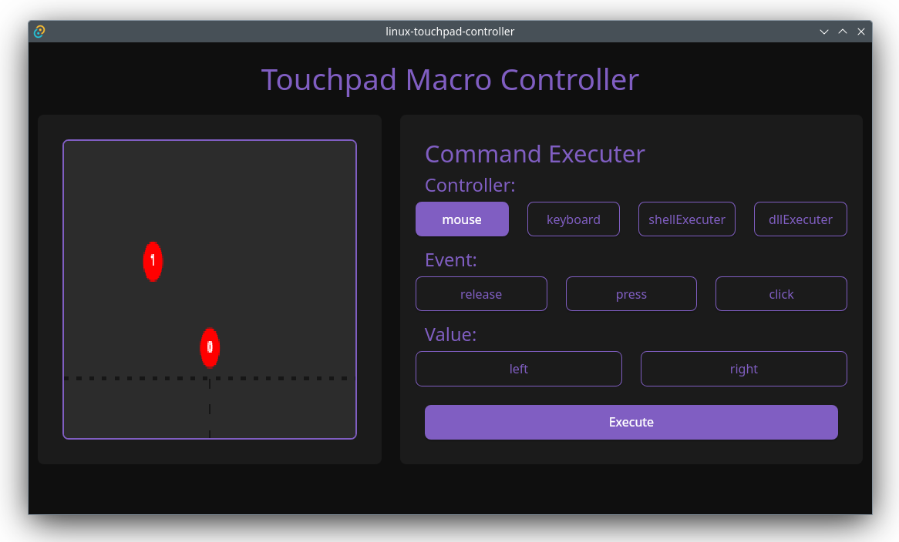

# TouchDaemon

Linux touch daemon

Linux sistem event'leri üzerinden touchpad olaylarını dinler.
Kullanıcılar kontrol panelinden parmak sayısı, konumu ve
süresine göre istedikleri touchpad kullanımına göre 
macro(keyboard, mouse, exec) komutları atayabilir.

Kullanıcı arayüzü, dokunuşları handle'lamayı sağlayan kendi query
dili sayesinde driver içerisindeki mouse, keyboard, shell command
executer gibi kontrolcüleri çalıştırabilir veya dll import özelliği
ile kendi fonksiyonlarını tetikleteiblir.

## Örnekler

- Touchpad üzerinde neredeyse aynı noktaya bir saniye içinde
  iki kere dokunulursa click macrosu tetiklenir.
- Touchpad'in sağ üstüne 3 saniye boyunca parmak değdirilirse
  google-chrome açılır
- Touchpad'in sol üstüne 3 saniye basılı tutulduktan sonra
  sağındaki 50px'lik alanda parmak yukarı ve aşağı yönde
  haraket ettirilerek ses düzeyi değiştirilir

## Sistem
- [Driver]: Touchpad'i dinler, TCP üzerinden parmak konumlarını iletir ve
            mouse, keyboard, shell, D-Bus, DLL gibi kontrolcüler aracılığıyla
            komut çalıştırır. Shell komutlarının çıktısını da istemciye geri gönderir.
- [Panel]: Tauri + React tabanlı kontrol paneli. Touchpad'in anlık durumunu
           canvas üzerinde gösterir; macro ve komut gönderimi, shell çıktısını
           görüntüleme imkânı sunar.

# License
This project is licensed under the [MIT License](./LICENSE).
